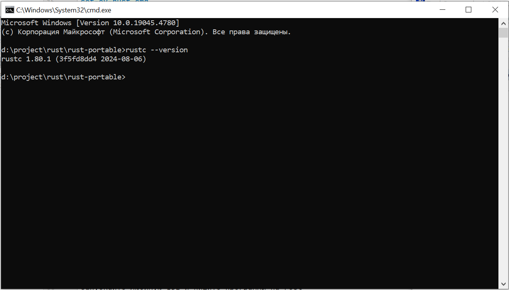
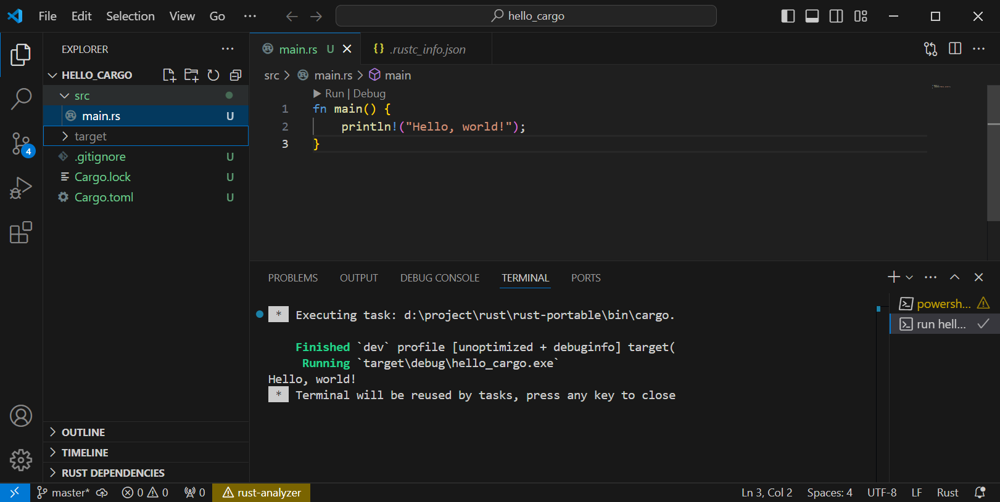

# portable-rust

Проект для быстрого начала программирования в rust.

Скачайте проект
```shell
git clone https://github.com/malexple/rust-portable.git
```

Запустите файл **install-portable.cmd**

Данный скрипт распакует файлы rust и запустит скрипт, который пропишет пути в переменных среды.

```shell
tar -xf portable-rust_1.zip
tar -xf portable-rust_2.zip
tar -xf portable-rust_3.zip
set-ev-rust.cmd
```
Скрипт в **set-ev-rust.cmd** пропишет переменные среды для rust.
```shell
setx DRIVE "%cd%"
setx RUST_HOME "%DRIVE%\rust"
setx RUST_PATH "%DRIVE%\bin"
setx MINGW_PATH "%CD%\MinGW"

setx PATH "%PATH%;%DRIVE%\bin;%MINGW_PATH%\bin;%MINGW_PATH%\msys\1.0\bin;%MINGW_PATH%\dll"
```


В распакованном виде файлы rust занимают чуть более 600Mb. Так как в gitHub есть ограничение на файлы более 100Mb было решено разбить содержимое на несколько архивов.

Вы можете запустить скрипт **rust-install.cmd** и установить rust из установочного файла rust-1.80.1-x86_64-pc-windows-gnu.msi и собрать свою portable версию rust
````shell
rem скачиваем файл установки, если есть запускаем
if exist rust-1.80.1-x86_64-pc-windows-gnu.msi (
rust-1.80.1-x86_64-pc-windows-gnu.msi
) else (
curl.exe --output rust-1.80.1-x86_64-pc-windows-gnu.msi --url https://static.rust-lang.org/dist/rust-1.80.1-x86_64-pc-windows-gnu.msi
)
````

Проверить что все установлено правильно можно командой
````shell
rustc --version
````




Создаем проект командой 

```sh
cargo new hello_cargo
```

Открываем в VSCode. Ставим Cargo Extension Pack. Открываем проект hello_cargo и можем запускать.




