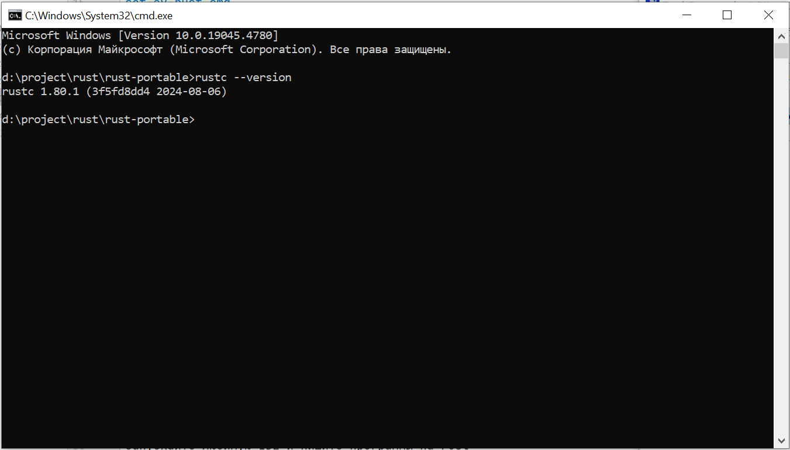
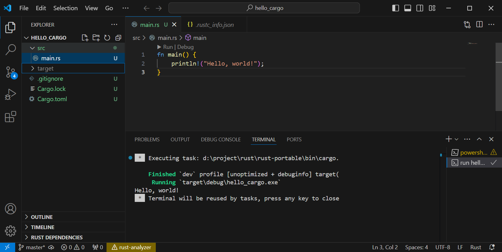

# Rust Portable

A project to quickly start programming in rust.

Download the project
```shell
git clone https://github.com/malexple/rust-portable.git
```

1. Run the file **install-portable.cmd**

This script will unpack the rust files and run the script, which will set the paths in the environment variables.

```shell
tar -xf portable-rust_1.zip
tar -xf portable-rust_2.zip
tar -xf portable-rust_3.zip
set-ev-rust.cmd
```
2. The script in **set-ev-rust.cmd** will set environment variables for rust.
```shell
setx DRIVE "%cd%"
setx RUST_HOME "%DRIVE%\rust"
setx RUST_PATH "%DRIVE%\bin"
setx MINGW_PATH "%CD%\MinGW"

setx PATH "%PATH%;%DRIVE%\bin;%MINGW_PATH%\bin;%MINGW_PATH%\msys\1.0\bin;%MINGW_PATH%\dll"
```

3. Everything can be used. When unpacked, the rust files take up just over 600Mb. Since gitHub has a limit on files larger than 100Mb, it was decided to split the contents into several archives.

You can run the script **rust-install.cmd** and install rust from the installation file rust-1.80.1-x86_64-pc-windows-gnu.msi and build your own portable version of rust
````shell
rem download the installation file, if available, run it
if exist rust-1.80.1-x86_64-pc-windows-gnu.msi (
rust-1.80.1-x86_64-pc-windows-gnu.msi
) else (
curl.exe --output rust-1.80.1-x86_64-pc-windows-gnu.msi --url https://static.rust-lang.org/dist/rust-1.80.1-x86_64-pc-windows- gnu.msi
)
````

You can check that everything is installed correctly with the command
````shell
rustc --version
````




We create a project as a team

```sh
cargo new hello_cargo
```

Open in VSCode. Install Cargo Extension Pack. Open the hello_cargo project and we can launch it.

